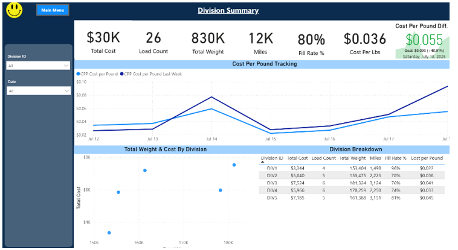
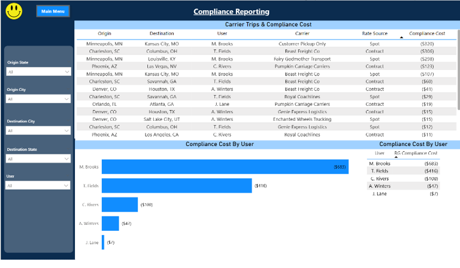
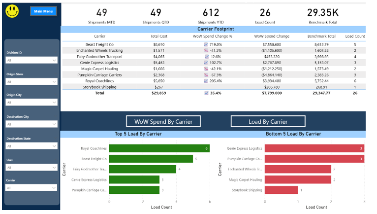

# TMS

A sample Power BI report (`TMS.pbix`) simulating a Transportation Management System (TMS) dashboard for a logistics/freight operation. All data is synthetic and built for portfolio demonstration purposes only — carrier names, dollar figures, and shipment details are not real.

## Where the data lives

The working copy of `TMS.pbix` and its source CSVs live on an **on-premises** company file server (a mapped network drive), not in cloud storage like OneDrive or SharePoint. This GitHub repo is a snapshot of those files for portfolio/sharing purposes. If you want the report to refresh against live data rather than the CSVs bundled here, you'd need network/VPN access to that on-prem share, and if it were ever published to the Power BI Service, scheduled refresh would require an **on-premises data gateway** pointed at that file location.

## How to open this report

1. Install [Power BI Desktop](https://powerbi.microsoft.com/desktop/) (free, Windows only) — via the link or the Microsoft Store.
2. Download or clone this repo, keeping `TMS.pbix` and the `Production/` folder side by side in the same layout they're in here — the report's data source paths are relative to that structure.
3. Double-click `TMS.pbix` to open it in Power BI Desktop.
4. If you see a "couldn't find file" / "file not found" warning for the source CSVs, go to **Home → Transform Data → Data Source Settings**, select each `tms_*.csv` source, and click **Change Source** to repoint it at your local copy of the `Production/` folder.
5. Click **Refresh** on the Home ribbon to load the CSV data into the report.
6. You'll land on the **Main Menu** page — click one of its tiles (Division Summary, Compliance Reporting, Carrier Footprint) to navigate. There are no page tabs in this report; those buttons are the only way to move between pages. Note that in the default editing view, navigation buttons need a **Ctrl+click** to activate (a plain click just selects the button for editing) — switch to **Reading View** (View ribbon, top right) if you want plain clicks to work like a normal viewer would experience.

## Contents

| File | Description |
|---|---|
| `TMS.pbix` | The Power BI Desktop report — three dashboard pages plus a navigation menu, described below. |
| `Production/tms_TransportationLoadLevels.csv` | Load-level fact table: one row per shipment, with division, origin/destination, carrier, mode, service level, weight, and the freight/accessorial/total/benchmark cost breakdown. Drives most of the Division Summary and Carrier Footprint visuals. |
| `Production/tms_StopLevelDetails.csv` | Stop-by-stop detail for each load (pickup and delivery stops) — location, distance/duration from the previous stop, planned quantities, and appointment vs. actual arrival/departure times. |
| `Production/tms_InboundDetails.csv` | Inbound shipment tracking detail — carrier, shipper/consignee, pickup and delivery dates, weight, miles, rate, and total charges per load. |
| `Production/tms_ReferenceTableLaneOwner.csv` | Lookup table mapping each division/lane ownership key to the user responsible for it. |

## Report pages

### Main Menu
The landing page. It gives a one-click jump to each of the three views below (Division Summary, Compliance Reporting, Carrier Footprint).

### Division Summary

Division-level performance overview. KPI cards across the top summarize Total Cost, Load Count, Total Weight, Miles, Fill Rate %, and Cost per Lb, alongside a "Cost per Pound Diff." card comparing actual cost/lb to a target goal. Below that, a trendline tracks Cost per Pound day-over-day against the same metric from the prior week, and a scatter plot plus breakdown table compare cost and weight across each division (DIV1–DIV5). Slicers on the left filter everything by Division ID and Date.

### Compliance Reporting

Audits carrier trips against expected/contracted rates. The main table lists every trip with origin, destination, the user who booked it, carrier, rate source (Spot vs. Contract), and the resulting compliance cost (the $ variance from the benchmark rate). A bar chart and table below roll that variance up by user, making it easy to see who is booking the most out-of-compliance freight. Slicers filter by origin/destination city and state and by user.

### Carrier Footprint

Carrier-level spend and volume tracking. KPI cards show Shipments MTD/QTD/YTD, Load Count, and Benchmark Total. The main table breaks out total cost, week-over-week spend change (% and $), benchmark total, and load count per carrier. Two toggle buttons ("WoW Spend By Carrier" / "Load By Carrier") switch the charts below between top-5 and bottom-5 carriers by load volume. Slicers on the left filter by division, origin/destination, user, and carrier.

## How it works

- **Data source** — the report connects directly to the four CSVs in `Production/` (Home → Get Data → Text/CSV in Power Query). There's no database or gateway involved when you're just working in Desktop; a gateway only comes into play if this gets published to the Power BI Service for scheduled refresh.
- **Data model** — `tms_TransportationLoadLevels.csv` is the core fact table (one row per load) and drives most of the Division Summary and Carrier Footprint visuals. `tms_StopLevelDetails.csv` relates to it on `LoadNum` for stop-by-stop routing detail. `tms_ReferenceTableLaneOwner.csv` is a small lookup table matching each lane's "Owner Key" to the user who owns it, which is what powers the per-user breakdown on Compliance Reporting. `tms_InboundDetails.csv` tracks inbound shipments separately, keyed by PO# and billing division.
- **Filtering** — each page has its own slicer panel in the left rail; selections apply only to that page, not globally across the whole report.
- **Navigation** — page tabs are intentionally hidden for a cleaner viewing experience. Moving between pages only happens through the on-canvas buttons (Main Menu → a page, and a "Main Menu" button on each page to go back).
